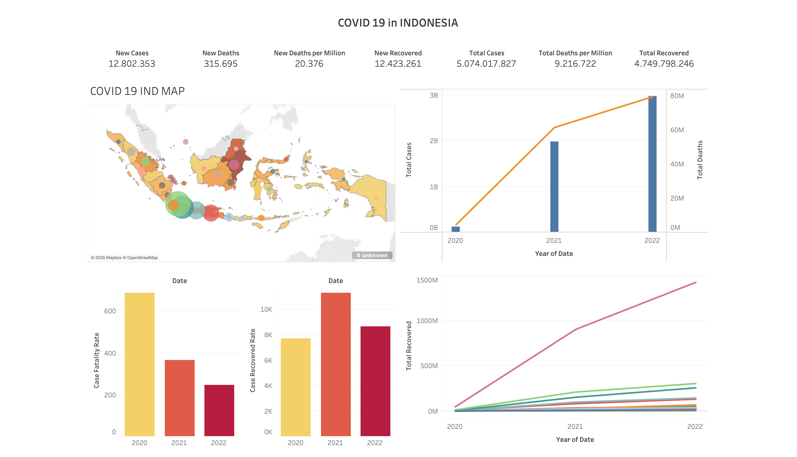

# COVID-19 Dashboard Indonesia

## Project Overview
This project visualizes the spread and impact of COVID-19 in Indonesia from 2020 to 2022 using Tableau Public. The dashboard highlights key metrics such as confirmed cases, deaths, recoveries, and displays geographic trends via a map.

## Tools Used:
- Tableau Public
- Microsoft Excel (for data preprocessing)

## Key Insights:
- Significant rise in confirmed cases during 2021–2022.
- Highest death rate occurred in 2021.
- Recovery numbers improved consistently across the years.
- Regional disparities clearly shown on the map visualization.

## 📌 Dashboard Preview:

## 🔗 View Interactive Dashboard:
[Click here to view on Tableau Public](https://public.tableau.com/views/Covid19inindonesia_17504695937730/Dashboard1) 

## Data Source:
The dataset was collected from public COVID-19 data sources and processed in Excel before visualization.
